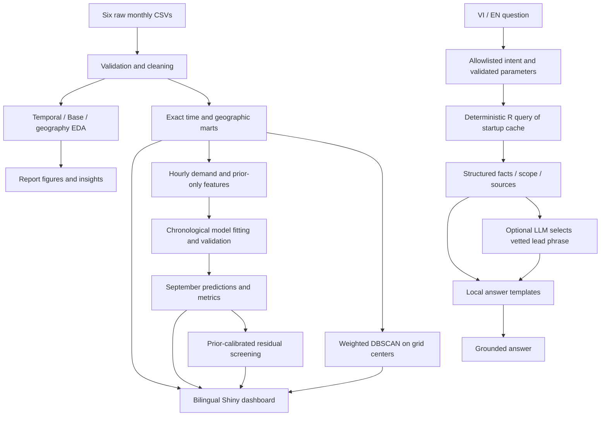

# Uber NYC Data Analysis — R + Shiny

A reproducible university project covering exploratory analysis, hourly forecasting, residual anomaly screening, spatial clustering and a grounded bilingual Data Assistant. The dashboard describes **4,534,327 recorded Uber pickups, April–September 2014**. It is a historical analysis, not a live Uber service.

## Quick start

Work in the directory containing `Main.R`. This download contains an extra outer directory; do not run commands from that outer directory.

```sh
Rscript --vanilla R/00_setup.R
Rscript --vanilla Main.R
Rscript --vanilla tests/run_all_tests.R
Rscript -e 'shiny::runApp("app", host="127.0.0.1", port=3843, launch.browser=TRUE)'
```

Exact PowerShell commands for the current Windows machine:

```powershell
Set-Location 'C:\Users\Admin\Downloads\Uber-Data-Analysis-R.-Shiny-Dashboard\Uber-Data-Analysis-R.-Shiny-Dashboard'
& 'C:\Program Files\R\R-4.6.1\bin\Rscript.exe' --vanilla R/00_setup.R
& 'C:\Program Files\R\R-4.6.1\bin\Rscript.exe' --vanilla Main.R
& 'C:\Program Files\R\R-4.6.1\bin\Rscript.exe' --vanilla tests/run_all_tests.R
& 'C:\Program Files\R\R-4.6.1\bin\Rscript.exe' -e 'shiny::runApp("app",host="127.0.0.1",port=3843,launch.browser=TRUE)'
```

In R/RStudio, `source("Main.R", encoding="UTF-8")`, then `shiny::runApp("app")`. If processed outputs already exist, launch Shiny directly. Stop the app before rebuilding outputs and restart afterwards; sessions deliberately cache one consistent startup snapshot.

Setup creates a project-local `.r-library` and installs only missing dependencies from CRAN. It does not pin versions. Dependencies: ggplot2, dplyr, tidyr, lubridate, scales, readr, shiny, bslib, leaflet, DT, plotly, rpart, ranger, xgboost, dbscan, stringi, jsonlite, httr and htmlwidgets. Only setup installs packages. The Shiny app never installs or trains anything. Tested on Windows with R 4.6.1; exact modeling versions are exported in `output/model/model_metadata.csv`. Linux/macOS and clean-machine package installation are not claimed as tested.

## Dataset and provenance

The six monthly files in `data/` correspond to the [FiveThirtyEight Uber TLC FOIL release](https://github.com/fivethirtyeight/uber-tlc-foil-response), obtained from NYC's Taxi & Limousine Commission. This project uses only April–September 2014, not the release's other companies or 2015 data. Local files were retained, not replaced by downloads.

| Column | Meaning |
|---|---|
| Date/Time | Supplied pickup date and time |
| Lat, Lon | Pickup latitude and longitude |
| Base | TLC base-company code affiliated with the pickup |

The dashboard convention calls these Dispatch Bases; the source does not identify an individual driver or supply a verified trip ID. Counts mean pickup **records**, not deduplicated unique journeys. The project reports and retains **82,581 duplicate rows** because matching four fields is insufficient to establish duplication of a real journey. Missing required values, date parsing failures and invalid geographic ranges are reported in quality outputs; they are all zero in these supplied files. No unsupported imputation of missing fields occurs.

Timestamps preserve supplied wall-clock components. UTC in exported hourly timestamps is a storage convention, not a conversion of New York time. Models complete the hourly grid with zero counts; absence of observations may indicate missing coverage.

## Architecture



## Files and pipeline order

```text
Main.R                         Runs stages 00–09 in order
R/
  00_setup.R                   Dependencies and output directories
  01_data_cleaning.R           Six-file input, validation and time features
  02_time_analysis.R           Hour/date/month/weekday/day-type summaries
  03_base_analysis.R           Base ranking and calendar comparisons
  04_location_analysis.R       Coordinate quality, bbox, grid, report sample
  05_visualization.R           Nine PNG report figures
  06_insight_dashboard.R       Exported EDA findings
  07_dashboard_marts.R         Exact time and geographic cubes
  08_demand_model.R            Four-model experiment
  09_ai_analytics.R            Anomalies AND weighted DBSCAN
  model_helpers.R              Features, training and metric functions
  ai_helpers.R                 Residual scoring and spatial clustering
app/
  app.R                        Nine-page application; cached output loading
  helpers.R / components.R     Analytical operations / presentation
  i18n.R                       Shared VI/EN catalogue and formatting
  ai_components.R              Saved anomaly and cluster UI
  data_assistant.R             Intent parser, queries, factual templates
  assistant_provider.R         Optional constrained provider adapter
  assistant_ui.R               Chat/context/session integration
  www/                         CSS, language.js, assistant.js
output/
  results/                     Cleaned CSV, EDA and quality summaries
  dashboard/                   Two exact compact cubes
  model/                       Predictions, metrics, importance, tuning, metadata
  anomaly/                     Scored hours and calibration summary
  clusters/                    Membership, summary, sensitivity and metadata
  figures/                     Nine report PNGs
  logs/                        Local execution/audit evidence; excluded from submission
report/                        Original Word placeholder; currently zero bytes
tests/                        Six verify suites and master runner
PROJECT_SUMMARY.md              Vietnamese oral-defense overview
DEFENSE_QA.md                   Defense questions and concise answers
DEMO_SCRIPT.md                  5–7 minute Vietnamese demo
```

`output/results/` intentionally retains the existing cleaned-data/EDA layout; files were not duplicated into cosmetic new directories. Stage 09 combines the two AI analytics operations. Stages 01–06 can run individually when their predecessor outputs exist; stage 07 uses the full-cleaned and NYC objects established by earlier stages, so run it through `Main.R`. Stages 08 and 09 also support standalone execution against existing compact inputs. If stage 08 is rerun, rerun stage 09 before restarting Shiny so anomaly lineage stays consistent.

Two stage-local `load_result()` definitions serve the standalone visualization and insight scripts. They are not loaded by Shiny. Legacy prediction aliases (`Baseline`, `Prediction`, `Residual`) intentionally remain because old tests and the original-tree residual chart use them.

## Dashboard pages and filter contracts

| Vietnamese | English | Purpose |
|---|---|---|
| Tổng quan | Overview | Counts, peaks, daily trend and day-type averages |
| Mô hình nhu cầu | Demand Patterns | Exact Date × Month × DayType × Weekday × Hour × Base intersections |
| Phân bố địa lý | Geography | Grid Density and AI Clusters in one page |
| Phân tích Base | Base Analysis | Rank/share under the same calendar filters |
| Dự báo | Prediction | Four models, metrics, predictions, importance and limitations |
| Bất thường | Anomalies | Observed/expected demand, residuals and scores |
| Trợ lý dữ liệu | Data Assistant | Grounded VI/EN questions with sources |
| Khám phá dữ liệu | Data Explorer | Compact tables and matching-row CSV downloads |
| Phương pháp | Methodology | Nine sections explaining the full analytical chain |

Default language is Vietnamese. Language changes only presentation: canonical filters, numerical data and selected page remain unchanged. CSV downloads preserve stable machine-readable English column names/values; algorithm names, file names and third-party OpenStreetMap labels/attribution are not translated. Existing chat answers retain the language in which they were produced.

The time cube has **21,852 rows**, the geographic cube **23,795 rows**, together approximately **1.58 MB**. Shiny reads compact marts, quality reports and saved model/AI results once. It does not read the raw 4.5M rows, the large cleaned file or the 50,000-row report sample. No Random Forest/XGBoost fitting, DBSCAN or external API call occurs during normal startup.

- Demand averages divide by eligible calendar days, including zero-pickup dates for the chosen Base/hour. Incompatible calendar filters give a localized empty state.
- Verified regression intersection: September + Weekday + Thursday + 17:00 + B02617 = **4,170**, across four eligible dates.
- Base share denominator includes every Base under the same calendar filters. It is not citywide market share or business performance.
- Geographic bbox: latitude 40.5774–40.9176, longitude −74.1500–−73.7004. It contains **4,462,626** pickups; valid-coordinate coverage rounds to **98.42%**. A rectangle is not an administrative boundary.
- Grid centers use `round(coordinate / 0.01) * 0.01`. They are not exact 1 km² cells or named neighborhoods. Top N affects display only; shares use all matching cells.
- Leaflet basemap tiles require internet. Counts, coordinates, markers and offline assistant calculations do not depend on external model services.

## Machine learning experiment

Target: total recorded pickups in each citywide hourly bin, summed across Bases. There are 4,392 bins. Evaluation is **rolling one hour ahead**: predicting hour t assumes observations through t−1 are already available. Earlier September observations may be used by later September lag features. This is not a fixed-origin forecast of the entire month.

| Stage | Period | Hours |
|---|---|---:|
| Lag warmup | April 1–7 | 168 |
| Ensemble candidate training | April 8–July 31 | 2,760 |
| Ensemble validation | August 1–31 | 744 |
| Final model training | April 8–August 31 | 3,504 |
| Common holdout | September 1–30 | 720 |

No model fitting, parameter selection or early stopping uses September targets. No random time-series split is used.

- **Seasonal Naive:** observed count at t−168, no fitted parameters.
- **Regression Tree:** rpart; Hour, Weekday, DayIndex, lag_24, lag_168; cp 0.002, minsplit 30, maxdepth 8, xval 0.
- **Random Forest:** ranger, 400 trees; four August-validated combinations of mtry {5,10} and min.node.size {5,15}; selected 5/5.
- **XGBoost:** squared-error objective, histogram trees; depth {3,5}, min_child_weight {5,15}, eta 0.05, subsample/colsample 0.8. August-only early stopping (30 rounds patience, maximum 400); selected depth 5, weight 15, 78 rounds.

Both ensembles use seed 42, two threads, and the same 15 predictors: Hour, Weekday, DayType, Month, DayOfMonth, DayIndex; lags 1/2/24/48/168; prior rolling means 3/24/168 and prior rolling standard deviation 24. Windows end at t−1. Weekday is one-hot encoded for XGBoost using predefined levels.

The original tree has five predictors; ensembles have fifteen. Therefore gains compare **forecasting systems**, not algorithms under an identical feature set. Features are correlated and importance is descriptive: tree split improvement, forest impurity decrease and boosting gain are normalized within each model, not comparable causal effects.

### Rebuilt September metrics

| Model | MAE | RMSE | MAPE | R² |
|---|---:|---:|---:|---:|
| Seasonal naive (last week) | 223.32 | 349.19 | 16.28% | 0.804 |
| Regression tree | 288.06 | 422.08 | 20.90% | 0.714 |
| Random Forest | 156.84 | 225.31 | 12.17% | 0.919 |
| XGBoost | 141.19 | 205.74 | 11.28% | 0.932 |

**XGBoost has the lowest test RMSE.** The dashboard chooses its highlight from metrics, never from an “AI wins” assumption. Seasonal Naive outperforms the original tree, but not the ensembles. Lower MAE/RMSE is better; higher R² is better. MAPE excludes actual-zero hours; R² uses the test-set mean. Metrics are for regression, not classification accuracy.

Saved files: `model_metrics.csv`, `predictions.csv`, `feature_importance.csv`, `model_metadata.csv`, `model_tuning.csv`, `model_session_info.txt`. Exact parameters, versions, cube checksum and runtimes accompany outputs. Timings are hardware-dependent and short steps may round to zero.

## Anomaly detection

Expected demand is the saved **Random Forest** prediction. This reference was selected between tuned ensembles by **August validation RMSE**, not September test RMSE. The pipeline checks this selection contract and fails rather than silently changing methods if it no longer holds.

September 1–7 (168 hours) calibrates the residual median and raw MAD. September 8–30 (552 hours) is scored:

```text
residual = observed − expected
score = abs(0.6744897501960817 × (residual − calibration median) / raw MAD)
flag = score > 3.5
```

Calibration median is 82.35329 pickups; raw MAD is 118.37923. A nonpositive MAD fails explicitly. **11 / 552 hours (1.99%)** are flagged. The largest positive residual is +952.4892 at September 13, 18:00. The highest-score/most-negative hour, September 30, 23:00, is zero-filled; its residual is −870.5487. This flag may reflect coverage, not a true collapse in demand.

Anomaly means unusually different from historical expectation. It is neither automatically an error nor evidence of a real-world event. Scores are not probabilities. Direction/minimum-score filters affect selected hours/KPIs/table/markers; chart lines retain all scored hours for context. Filters never change the 3.5 detection threshold. Files: `anomalies.csv`, `anomaly_summary.csv`.

## Hotspot clustering

Weighted DBSCAN uses **1,337 occupied grid centers** for all April–September bbox pickups, projected into local kilometre coordinates (equirectangular origin 40.75, −73.98). Radius = 1.5 km; core-neighborhood minimum = **20,000 pickups**, including the cell itself. This is pickup mass, not 20,000 grid cells. Border points are included.

Result: **3 clusters**, plus noise ID 0. Cluster 1: 4,125,187 pickups (92.44%); cluster 2: 107,640 (2.41%); cluster 3: 96,701 (2.17%). Noise: 133,098 pickups (2.98%) across 1,053 cells. IDs are ranked by all-period volume and fixed. Month/Base filters recompute volumes and weighted centers, not cluster membership. Every share includes noise in its denominator.

Grid Density is fixed spatial aggregation; DBSCAN is unsupervised density-connected grouping. Neither provides verified neighborhood names. The nine-setting sensitivity output yields 2–4 clusters, documenting parameter dependence rather than claiming a uniquely true partition. Files: `hotspot_clusters.csv`, `cluster_summary.csv`, `parameter_sensitivity.csv`, `analytics_metadata.csv`.

## Data Assistant

`question → allowlisted intent/parameters → deterministic R query → structured facts → local templates → answer with scope/source`. No generated R or SQL is executed. No raw pickups are uploaded. The assistant is a bounded interface to project evidence, not a separately trained forecasting model or open-domain chatbot.

20 supported intents (plus explicit `unsupported`):

```text
dataset_summary, main_findings, total_trips, peak_hour, peak_month,
peak_weekday, busiest_date, weekday_vs_weekend, base_rank, compare_bases,
compare_months, geographic_hotspots, bbox_count, cluster_summary,
model_comparison, feature_importance, anomaly_summary, methodology,
limitations, causal_limit
```

Examples: “Dataset có bao nhiêu bản ghi?”, “Khung giờ cao điểm là khi nào?”, “So sánh B02617 và B02598.”, “Random Forest và XGBoost khác nhau thế nào trong kết quả?”, “Có bao nhiêu anomaly?”, “Cụm hotspot nào lớn nhất?”, “Tóm tắt toàn bộ đồ án.” Supported Vietnamese without accents is normalized. Peak ties are preserved; Top N is capped at 20.

Current filters default ON; the sidebar follows the most recently visited analysis page and identifies its context. Explicit months override Month and clear the inherited date range; explicit Bases override Base. Geographic queries reject unsupported date/hour/weekday filters. Model comparison always states its frozen all-city September scope; anomalies cannot be split by Base. Feature importance defaults to XGBoost when no model is named and states this default.

“Còn hạng hai?” works after Base ranking using the previous result's scope. History holds 20 exchanges in the current session; clear resets it; refresh starts fresh. Clearly VI/EN questions determine answer language independently of UI language. Unsupported questions fail safely. Causal questions can show observations but explicitly cannot establish weather/event/traffic causes.

Sources: time/geo cubes; model metrics/importance; saved anomaly observations; cluster assignments and summaries. Method descriptions cite existing metadata/quality reports. No files are reread per question.

### Optional external phrasing

Offline mode is complete for supported questions. `.env.example` contains empty placeholders. R does not automatically load `.env`; use an ignored project `.Renviron` or process environment and restart R. Do not use `--vanilla` to launch if you expect R to read `.Renviron`.

```text
LLM_PROVIDER=local
LLM_API_KEY=
LLM_MODEL=
```

The existing adapter supports `LLM_PROVIDER=openai` with your own key and an explicitly chosen compatible model. Even when configured, external assistance is opt-in per session. The LLM can **only select a vetted direct/contextual lead phrase**; it cannot author arbitrary explanations or change any numerical facts, notes, sources or scope. It sends only the current question and compact result, never raw trips or chat history. The fixed endpoint has an eight-second timeout, no redirects/tools/retries, a strict schema and `store=false` (not a zero-retention guarantee). Missing config, timeout, quota errors, malformed response or extra fields use the full local answer. No credentials are exposed to the browser or error text.

## Tests and reproducibility

`tests/run_all_tests.R` discovers every `verify_*.R`, runs each in an independent `--vanilla` R process, prints a PASS/FAIL summary, continues after a failed suite and exits nonzero if any fail. Existing five suites were preserved; `verify_final_integration.R` adds submission contracts.

| Suite | Evidence |
|---|---|
| verify_dashboard.R | Raw September reconciliation, 140 intersections, every geographic cell, date filters, empty states |
| verify_i18n.R | Default VI, VI/EN/VI preservation of filters/numbers, renderer and localized-empty checks |
| verify_models.R | Independent metric recomputation, chronology, lag/window alignment, target poisoning, preserved tree/baseline |
| verify_ai_analytics.R | Independent MAD scores, future poisoning, weighted neighborhood mass, DBSCAN repeatability, filters |
| verify_data_assistant.R | 29 bilingual pairs, sources, denominators, history, HTML escaping, mocked provider failures |
| verify_final_integration.R | All 20 intents, 10 requested demo questions, output checksums, source syntax, compact startup |

The final rebuild uses a new R process with no restored workspace and overwrites generated outputs; it does not depend on existing in-memory objects. Raw inputs are retained. MD5 lineage tests detect stale model/cluster inputs. Package versions are recorded, but dependencies are not locked: a different version can change a result and require investigation rather than weakening regression tests.

## Submission and remaining limitations

- Read [PROJECT_SUMMARY.md](PROJECT_SUMMARY.md), [DEFENSE_QA.md](DEFENSE_QA.md) and [DEMO_SCRIPT.md](DEMO_SCRIPT.md) for oral defense. Final execution evidence is in [FINAL_QC.md](FINAL_QC.md).
- The original `report/BaoCao_Uber_Data_Analysis.docx` is **zero bytes**. It was not overwritten. Markdown documentation does not silently substitute for the university's required Word report.
- Exclude `.r-library/` (about 510 MiB), `.Rhistory`, `.RData`, `.Rproj.user/`, `.Renviron`, `.env`, logs and temporary files. `.gitignore` does not control ZIP creation. Do not ZIP the entire working directory blindly. Keep local dependencies for development.
- Keep the six raw CSVs when submission must reproduce the complete pipeline; compact outputs suffice only for an already-installed dashboard demo. The 323 MiB cleaned CSV is regenerated and can be omitted from submission. Preserve `.env.example`, source, tests, compact outputs, figures and documentation.
- Local logs include previous QA backups and hashes; they are intentionally retained outside the submission. No unverified deletion was performed. The supplied folder has no Git metadata, so there is no commit history to scan.
- No weather, traffic, events, fare, destination, driver information or modern Uber context. Pickups do not measure unmet demand. One validation month and one holdout are limited evidence; no confidence intervals or prospective deployment claims.
- Basemap availability needs internet. Optional provider calls are not required by the demo; failure behavior is tested with mocks. Chat history may contain both languages by design; the interface itself is translated.

No additional feature expansion is planned in this stabilization iteration.
